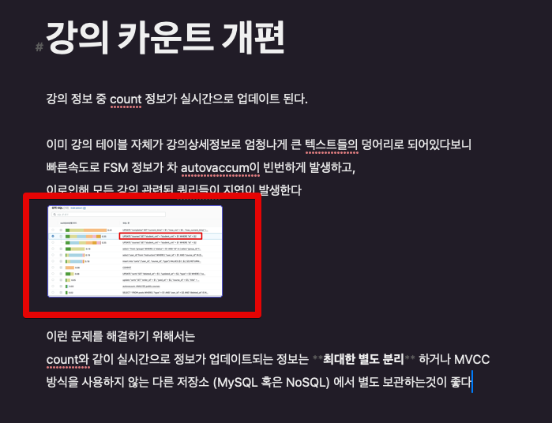

# Ulysses 에서 에디터내 이미지 크기 조절

최근에 메모앱으로 [Ulysses](https://ulysses.app/) 를 써보고 있습니다.

> 에버노트에서 완전히 이주하게 되면 메모앱 정착기도 정리해보겠습니다.

처음 Ulysses를 작성할때 메모 작성과 폴더 관리가 원하던 의도 그대로 표현이 되어서 마음에 들었습니다.  
다만 이미지 리사이즈가 별도로 되지 않아서 잠깐 고민을 했었는데요.  
  
Ulysses 에서는 **이미지별로 사이즈 조절은 없고**, 전체 설정으로 이미지들의 크기를 일괄 관리하는 기능만 존재합니다.  
  
그래서 아래와 같이 기본 이미지 등록을 하면 굉장히 작은 사이즈로 이미지가 보이게 되는데요.

가독성 문제도 있어서 이미지 사이즈 크기를 조절해봅니다.  
  
먼저 환경설정 (`Command + ,`) 으로 이동하신뒤

일반 (General) -> **이미지 미리보기** 에서 사이즈 조절을 하시면 됩니다.

기본값이 4인데, 저 같은 경우엔 8로 조정했습니다.  
  
**변경 후 Enter**를 쳐야만 적용됩니다.  
  
그럼 다음과 같이 이미지가 전체 조정 된 것을 볼 수 있습니다.

> 왜 개별 이미지 조절 기능이 없을까 싶다가, 최대한 마우스 없이 글 작성에만 집중하는게 컨셉이라는것을 알게되고 난뒤엔 이해하게 되었습니다.